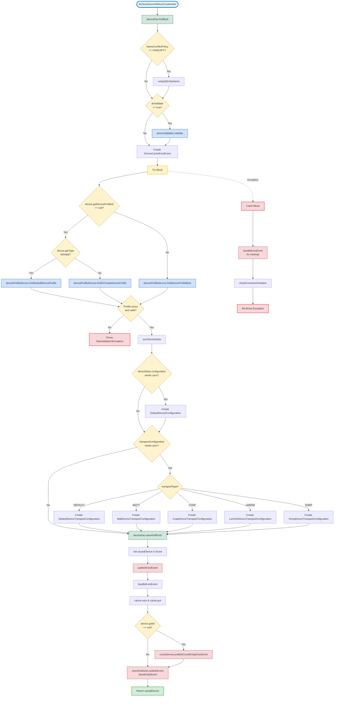

# Impact Analysis Report - Assignment 2
## ThingsBoard Device Service Module

**Student Name:** Hongyi Cai
**Student ID:** S2175463
**Date:** January 4, 2026
**Repository:** ThingsBoard Legacy System

---

## 1. Component Selected

**Method:**
`DeviceServiceImpl.doSaveDeviceWithoutCredentials(Device device, boolean doValidate, NameConflictStrategy nameConflictStrategy)`

**File Path:**
`dao/src/main/java/org/thingsboard/server/dao/device/DeviceServiceImpl.java:238-284`

**Graph Type:**
**Call Graph** - Visualizes the functions and methods within the code and how they interact during execution.

---

## 2. Executive Summary

The `doSaveDeviceWithoutCredentials` method is a core business logic component in the ThingsBoard IoT platform responsible for persisting device entities to the database. This method orchestrates multiple operations including:

- Device name uniquification to prevent conflicts
- Data validation through validator components
- Device profile resolution and association
- Device configuration synchronization
- Database persistence with transaction management
- Cache management through event-driven eviction
- Entity count tracking for analytics
- Event publishing for system-wide notifications
- Error handling with constraint violation detection

This method serves as a critical integration point that coordinates between multiple service layers, data access objects, validators, and event publishers.

---

## 3. Impact Analysis

### 3.1 Direct Dependencies

The method directly depends on the following components:

1. **DeviceDao** (`deviceDao`)
   - `findById()` - Retrieves existing device from database
   - `saveAndFlush()` - Persists device entity with immediate flush
   - **Impact**: Database schema changes or DAO modifications directly affect save operations

2. **DeviceDataValidator** (`deviceValidator`)
   - `validate()` - Validates device data integrity and business rules
   - **Impact**: Validation rule changes affect which devices can be saved

3. **DeviceProfileService** (`deviceProfileService`)
   - `findOrCreateDeviceProfile()` - Finds or creates profile by device type
   - `findDefaultDeviceProfile()` - Retrieves default tenant profile
   - `findDeviceProfileById()` - Retrieves specific profile by ID
   - **Impact**: Profile service changes affect device type resolution and configuration

4. **EntityCountService** (`countService`)
   - `publishCountEntityEvictEvent()` - Triggers count recalculation
   - **Impact**: Analytics and dashboard count updates depend on this integration

5. **ApplicationEventPublisher** (`eventPublisher`)
   - `publishEvent()` - Broadcasts SaveEntityEvent to listeners
   - **Impact**: All downstream event listeners are affected by event structure changes

6. **Cache** (`cache` - inherited from CachedVersionedEntityService)
   - `evict()` - Removes stale cache entries
   - `put()` - Updates cache with new device data
   - **Impact**: Cache key structure changes affect cache hit rates

### 3.2 Internal Method Dependencies

1. **uniquifyEntityName()**
   - Ensures device names are unique within tenant scope
   - **Impact**: Name conflict resolution strategy affects device naming

2. **syncDeviceData()**
   - Synchronizes device configuration based on profile type
   - Handles transport configuration (MQTT, CoAP, LWM2M, SNMP, Default)
   - **Impact**: New transport types require method updates

3. **publishEvictEvent()**
   - Triggers cache eviction via DeviceCacheEvictEvent
   - **Impact**: Cache invalidation strategy affects system consistency

4. **handleEvictEvent()**
   - Error recovery mechanism for cache cleanup
   - **Impact**: Error handling changes affect data consistency

5. **checkConstraintViolation()**
   - Translates database constraints to user-friendly errors
   - **Impact**: Database constraint changes require error message updates

### 3.3 Data Dependencies

1. **Device Entity**
   - Properties: id, name, tenantId, deviceProfileId, type, deviceData, externalId
   - **Impact**: Schema changes require migration and method updates

2. **DeviceProfile Entity**
   - Properties: id, name, type, tenantId, transportType
   - **Impact**: Profile schema changes affect synchronization logic

3. **NameConflictStrategy**
   - Policy: UNIQUIFY vs other strategies
   - **Impact**: Conflict resolution behavior changes affect device creation

### 3.4 Event-Driven Dependencies

1. **DeviceCacheEvictEvent**
   - Published to trigger cache invalidation
   - **Impact**: Listeners in other components react to device changes

2. **SaveEntityEvent**
   - Published for audit, notification, and synchronization
   - **Impact**: Multiple system components (audit, edge sync, webhooks) depend on this event

3. **CountEntityEvictEvent**
   - Published for entity count updates
   - **Impact**: Dashboard and analytics systems depend on count accuracy

### 3.5 External System Impact

1. **Database Layer**
   - Constraints: `device_name_unq_key`, `device_external_id_unq_key`
   - **Impact**: Constraint violations trigger specific error handling

2. **Caching Layer**
   - Cache keys: DeviceCacheKey(deviceId), DeviceCacheKey(tenantId, deviceId), DeviceCacheKey(tenantId, name)
   - **Impact**: Cache eviction affects read performance across the system

3. **Event Listeners**
   - Audit logging components
   - Edge synchronization services
   - Notification systems
   - Webhook handlers
   - **Impact**: Event structure changes require listener updates

---

## 4. Call Graph Visualization

The following Mermaid diagram illustrates the call flow and dependencies:

---

## 5. Key Findings

### 5.1 High Coupling Areas

1. **DeviceProfileService Dependency**
   - Three different methods called based on conditional logic
   - Changes to profile service contracts require updates to device service
   - **Mitigation**: Consider strategy pattern for profile resolution

2. **Transport Configuration Synchronization**
   - Switch statement handling five transport types
   - Adding new transport types requires code modification
   - **Mitigation**: Consider factory pattern or registry for extensibility

3. **Event Publishing Complexity**
   - Three different event types published (cache evict, count evict, save entity)
   - Event structure changes cascade to multiple listeners
   - **Mitigation**: Maintain backward compatibility in event schemas

### 5.2 Critical Control Flows

1. **Error Recovery Path**
   - Cache cleanup in catch block prevents stale data
   - Failure to clean cache could cause data inconsistency
   - **Risk**: High - affects data integrity

2. **Validation Bypass**
   - `doValidate` flag allows skipping validation
   - Incorrect usage could allow invalid data
   - **Risk**: Medium - requires careful API usage

3. **Name Uniquification**
   - Conditional based on NameConflictStrategy
   - Different strategies affect device naming behavior
   - **Risk**: Low - well-encapsulated

### 5.3 Performance Considerations

1. **Database Calls**
   - Two potential database calls (findById, saveAndFlush)
   - One additional call for profile lookup
   - **Impact**: Medium - transactional overhead

2. **Cache Operations**
   - Multiple cache keys managed (by ID, by tenant+ID, by tenant+name)
   - Cache eviction on both success and failure
   - **Impact**: Low - improves read performance

3. **Event Publishing**
   - Three events published per save
   - Asynchronous listeners don't block transaction
   - **Impact**: Low - event handling is async

### 5.4 Maintainability Concerns

1. **Method Length**
   - 47 lines with complex logic
   - Multiple responsibilities (validation, profile resolution, sync, save, events)
   - **Recommendation**: Consider extracting profile resolution logic

2. **Error Handling**
   - Custom constraint violation messages
   - Database constraint names hardcoded
   - **Recommendation**: Externalize constraint mappings

3. **Configuration Synchronization**
   - Device data sync logic embedded in save flow
   - Transport type switch statement
   - **Recommendation**: Extract to separate sync service

---

## 6. Impact Assessment Matrix

| Component | Impact Level | Change Type | Affected Systems |
|-----------|-------------|-------------|------------------|
| DeviceDao | **CRITICAL** | Schema/API changes | All device operations, cache, events |
| DeviceProfileService | **HIGH** | Profile logic changes | Device type resolution, configuration |
| DeviceDataValidator | **HIGH** | Validation rules | Device creation, data integrity |
| Cache | **HIGH** | Key structure changes | Read performance, consistency |
| EntityCountService | **MEDIUM** | Count logic changes | Dashboards, analytics |
| EventPublisher | **MEDIUM** | Event schema changes | Audit, edge sync, webhooks, notifications |
| Transport Configurations | **MEDIUM** | New transport types | Device communication, protocol support |
| Database Constraints | **MEDIUM** | Constraint changes | Error messages, validation |
| NameConflictStrategy | **LOW** | Strategy changes | Device naming behavior |

---

## 7. Recommendations

### 7.1 Immediate Actions
1. **Document Event Contracts** - Create schema documentation for all published events to prevent breaking changes
2. **Add Integration Tests** - Cover all transport configuration types and error paths
3. **Monitor Cache Hit Rates** - Ensure cache eviction strategy maintains performance

### 7.2 Medium-Term Improvements
1. **Extract Profile Resolution** - Move profile finding logic to strategy pattern
2. **Transport Factory** - Replace switch statement with pluggable transport factory
3. **Externalize Constraints** - Move database constraint messages to configuration

### 7.3 Long-Term Considerations
1. **Service Decomposition** - Consider separating device CRUD from device configuration sync
2. **Event Sourcing** - Evaluate event sourcing pattern for full audit trail
3. **Circuit Breaker** - Add resilience patterns for external service calls

---

## 8. Conclusion

The `doSaveDeviceWithoutCredentials` method serves as a critical orchestration point in the ThingsBoard device management subsystem. Its impact spans multiple layers:

- **Data Layer**: Direct database operations and constraints
- **Cache Layer**: Multi-key cache management affecting read performance
- **Service Layer**: Integration with validators, profiles, and count services
- **Event Layer**: Publishing events consumed by audit, sync, and notification systems

**Key Takeaways:**
1. Changes to this method have **high impact** due to wide dependency graph
2. Event-driven architecture provides loose coupling but requires careful event schema management
3. Cache invalidation strategy is critical for system consistency
4. Error handling paths are well-designed but require maintenance as constraints evolve
5. Transport configuration sync is a potential extensibility concern

**Overall Risk Assessment**: **MEDIUM-HIGH**
While the method is well-structured with proper error handling and event-driven patterns, its central role in device persistence means changes must be carefully analyzed for cascading effects across caching, event listeners, and dependent services.

---

**Appendix: Related Files**
- `dao/src/main/java/org/thingsboard/server/dao/device/DeviceDao.java`
- `dao/src/main/java/org/thingsboard/server/dao/device/DeviceProfileService.java`
- `dao/src/main/java/org/thingsboard/server/dao/service/validator/DeviceDataValidator.java`
- `dao/src/main/java/org/thingsboard/server/dao/entity/EntityCountService.java`
- `dao/src/main/java/org/thingsboard/server/cache/device/DeviceCacheEvictEvent.java`
- `common/data/src/main/java/org/thingsboard/server/common/data/Device.java`
- `common/data/src/main/java/org/thingsboard/server/common/data/DeviceProfile.java`

---

**Generated by:** Hongyi Cai (S2175463)
**Analysis Date:** January 4, 2026
**ThingsBoard Version:** master branch (commit: d9f18e2a46)
