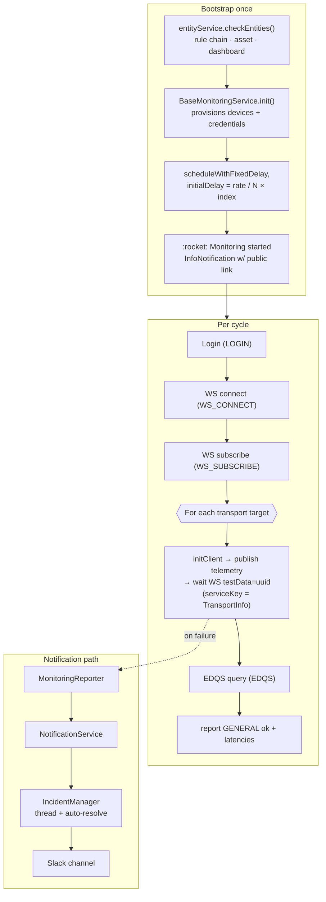
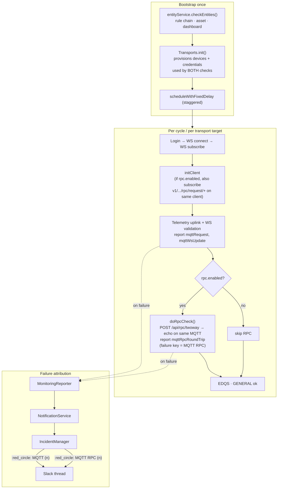
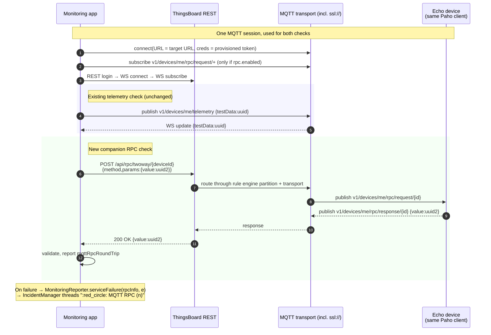

# RPC Monitoring — Design

| Status | Draft for review |
|--------|------------------|
| Author | Sergii Matviienko (`smatvienko@thingsboard.io`) |
| Date | 2026-04-29 |
| Module | `monitoring/` |
| Base | `upstream/rc` (CE) |

## 1. Background

`tb-monitoring` is an external service that probes a running ThingsBoard
deployment from outside the cluster. On startup it provisions every entity
it needs under a dedicated monitoring tenant — devices, profiles, calculated
fields, a rule chain, the latencies asset, and a public dashboard — and then
runs a continuous loop that, for every configured transport target, sends a
telemetry uplink and validates that the value arrives back over a WebSocket
subscription.

What the loop does **not** cover today is the **server-to-device direction**:
a working telemetry uplink does not prove that a two-way RPC issued by the
REST API will actually reach the device through the rule engine plus the
target transport. There are production failure modes where the uplink
remains green but RPC delivery is broken — for example, a stuck rule engine
partition, or a transport microservice that can publish telemetry inwards
but cannot deliver an RPC outwards.

Adding an opt-in RPC companion check to each transport target closes that
gap with a single new round-trip per cycle, reusing every entity and every
transport client the monitoring service already owns.

## 2. Current architecture (`rc`)

### 2.1 Bootstrap

`ThingsboardMonitoringApplication.startMonitoring` runs once on
`ApplicationReadyEvent`:

1. `MonitoringEntityService.checkEntities()` upserts the rule chain for the
   monitoring tenant, finds-or-creates the `[Monitoring] Latencies` asset,
   finds-or-creates the `[Monitoring] Cloud monitoring` dashboard, assigns
   both to the public customer, and remembers the dashboard public link.
2. For each `BaseMonitoringService` bean (transports today; RPC will fold in
   here too), `init()` walks its config's targets and calls
   `entityService.checkEntities(config, target)` to lazily create the
   device, device profile and (when `monitoring.calculated_fields.enabled`)
   the calculated field. The resulting `DeviceConfig` (id + access token) is
   written back into the target.
3. The scheduler stagger-schedules each `BaseMonitoringService` with
   `(monitoring_rate_ms / count) * i` initial delay — so two services on a
   10 s rate fire at 0 s and 5 s, not on top of each other.
4. A `:rocket: Monitoring started` info notification is emitted with a
   clickable public-dashboard link.

### 2.2 Per-cycle loop (`BaseMonitoringService.runChecks`)

Each tick is a single REST login → single WebSocket connect → single WS
subscription that covers every device this service owns → for each
`BaseHealthChecker` call `check(WsClient)`. Each phase has its own service
key so failures land precisely:

```
LOGIN              (MonitoredServiceKey.LOGIN)            "Login"
WS_CONNECT         (MonitoredServiceKey.WS_CONNECT)       "WS Connect"
WS_SUBSCRIBE       (MonitoredServiceKey.WS_SUBSCRIBE)     "WS Subscribe"
per-target check   (TransportInfo, implements ShortNameProvider)
EDQS (optional)    (MonitoredServiceKey.EDQS)             "*EDQS*"
GENERAL            (MonitoredServiceKey.GENERAL)          "Monitoring"
```

`BaseHealthChecker.check(WsClient)` is `final` and orchestrates a fixed
template:

```
initClient()                         // (re)open transport client
sendTestPayload(uuid)                // publish telemetry uplink
checkWsUpdates(...)                  // wait for WS testData=uuid
report ok / failure
```

Each transport implements `initClient`, `sendTestPayload`, `destroyClient`,
plus `getKey` / `getInfo` / `getTransportType`.

### 2.3 Failure attribution & incident grouping (PR #15456, merged)

`MonitoringReporter.serviceFailure(Object serviceKey, Throwable error)`
publishes a `ServiceFailureNotification` whose `getAffectedServices()`
returns `[failing(shortName(serviceKey), failuresCount)]`. `shortName`
delegates to `ShortNameProvider` when the key implements it
(`TransportInfo` already does — `"MQTT"`, `"MQTT Foo"` if a non-default
queue, etc.) and falls back to `serviceKey.toString()` otherwise.

`IncidentManager` (Slack API mode, `monitoring.notifications.incident.*`)
threads alerts that fire within `resolution_timeout_s` (default 90 s) under
a single Slack message. The header tracks failing / high-latency / recovered
services with red / yellow / green circles and updates every minute. After
the quiet window the incident auto-resolves with a final summary.

Any new service key fed through `MonitoringReporter` automatically lights up
in the incident header — no extra wiring needed beyond producing a stable,
unique short name.

### 2.4 Current flow

```text
  Bootstrap (once)                     Per-cycle (each service, staggered)
  ────────────────                     ──────────────────────────────────

  entityService.checkEntities()        Login (LOGIN)
        rule chain                     WS connect (WS_CONNECT)
        latencies asset                WS subscribe (WS_SUBSCRIBE)
        public dashboard               For each target (TransportInfo):
              │                          initClient
  ┌───────────┘                           publish telemetry → wait WS
  ▼                                       report request, wsUpdate
  TransportsMonitoringService.init()    EDQS (optional)
    provisions devices + creds          report latencies
  schedule each service with stagger    report GENERAL ok
  send :rocket: started notification

                                       ┌───────────────────────────┐
                                       │ MonitoringReporter        │
                                       │   .serviceFailure(key, e) │
                                       │   .serviceIsOk(key)       │
                                       └────────────┬──────────────┘
                                                    ▼
                                       ┌───────────────────────────┐
                                       │ NotificationService       │
                                       │   Slack webhook (legacy)  │
                                       │   IncidentManager (rc)    │
                                       │     thread + auto-resolve │
                                       └───────────────────────────┘
```



```text
  Monitoring app          ThingsBoard              MQTT transport       Echo device
  ──────────────          ───────────              ──────────────       ───────────
       │                       │                          │                    │
       ├─ login ──────────────►│                          │                    │
       ├─ WS connect ─────────►│                          │                    │
       ├─ WS subscribe ───────►│                          │                    │
       │                                                                       │
       │           ── For each transport target ──                              │
       ├─ MQTT publish v1/.../telemetry {testData:uuid} ─────────────────────►│
       │◄── WS update {testData:uuid} ──────────────────│                      │
       │                                                                       │
       ├─ EDQS query (optional)                                                │
       └─ report latencies, GENERAL ok                                         │
```

## 3. The gap

The check above proves a one-way path: REST login → WS subscribe →
device-to-cloud uplink. It does **not** exercise the cloud-to-device path
that production traffic relies on, namely:

```
REST API → rule engine partition → transport microservice → device → response
```

A failure anywhere along that chain (rule engine partition stuck on a
specific `queue`, a transport microservice unable to publish back, an MQTT
broker that accepts publishes but drops subscriptions) currently goes
undetected by `tb-monitoring`. Adding an RPC companion check to each
transport target closes the loop in both directions.

## 4. Proposed feature

**Core idea.** RPC is an opt-in *companion check* on each existing
transport target — same loop, same auto-provisioned device, same transport
client, one extra round-trip when enabled.

The shape mirrors the way the `monitoring.calculated_fields.enabled` flag
extends the existing telemetry check today: a flag tightens the assertion
performed within the same cycle on the same device — it does not spawn a
parallel monitoring service.

### 4.1 Configuration

A new optional `rpc:` sub-block on each `TransportMonitoringTarget`:

```yaml
monitoring:
  transports:
    mqtt:
      enabled: '${MQTT_TRANSPORT_MONITORING_ENABLED:true}'
      qos: 1
      request_timeout_ms: 4000
      targets:
        - base_url: '${MQTT_TRANSPORT_BASE_URL:tcp://${monitoring.domain}:1883}'
          queue: Main
          rpc:
            enabled: '${MQTT_RPC_MONITORING_ENABLED:false}'
            request_timeout_ms: '${MQTT_RPC_REQUEST_TIMEOUT_MS:4000}'
        - base_url: '${MQTT_TRANSPORT_SSL_BASE_URL:ssl://${monitoring.domain}:8883}'
          queue: Main
          rpc:
            enabled: true        # secure variant gets RPC for free
```

Properties of this shape:

- No new top-level config block — RPC is part of the transport target it
  exercises.
- The RPC sub-block carries no URL, no credentials, no QoS. Those are
  inherited from the parent target. Secure transports (`ssl://`, client
  certs) Just Work.
- A target without `rpc:` (or with `rpc.enabled: false`) keeps today's
  behaviour identically — pure addition.
- Multiple targets per transport (already supported via `targets[N]`) cover
  partition fan-out automatically; each target gets its own RPC sub-check
  if enabled.

### 4.2 Java surface

```
BaseHealthChecker
  + protected void doRpcCheck(...)         // default: no-op
  // check(WsClient) stays final; reporter / stopWatch stay private

TransportMonitoringTarget
  + RpcCheckConfig rpc                     // nullable; defaults to disabled

config.transport.RpcCheckConfig            // new
  - boolean enabled
  - Integer requestTimeoutMs               // optional override

config.transport.RpcInfo
  // ShortNameProvider wrapper that returns "<TransportInfo.shortName> RPC"
  // so failures appear as a distinct row in the IncidentManager header.

MqttTransportHealthChecker
  + extends initClient()                   // when rpc.enabled, also subscribe
                                           //   v1/devices/me/rpc/request/+
                                           //   on the existing MqttClient and
                                           //   echo params back as the response
  + overrides doRpcCheck()                 // POST /api/rpc/twoway/{deviceId},
                                           //   validate the echoed value,
                                           //   report rpcRoundTrip latency
```

`BaseHealthChecker.check(WsClient)` is extended once at the end of its
existing template:

```
initClient()
sendTestPayload(uuid)
checkWsUpdates(...)
if (rpcCheckEnabled()) doRpcCheck();   // new, after telemetry validates
report ok / failure
```

A telemetry-uplink failure short-circuits the RPC sub-check (the existing
try/catch around `sendTestPayload` already does this). The RPC sub-check
reports its own dedicated failure key so the incident header tells apart
"device can publish telemetry" from "rule engine can deliver an RPC".

### 4.3 Latencies and failure keys

- New latency: `<key>RpcRoundTrip` (e.g. `mqttRpcRoundTrip`,
  `mqttFooRpcRoundTrip` for non-default queues), reported alongside the
  existing `<key>Request` and `<key>WsUpdate` keys for the same target.
- New failure service key: an `RpcInfo(TransportInfo)` instance whose
  `getShortName()` returns `"<transport.shortName> RPC"` (e.g.
  `"MQTT RPC"`, `"MQTT Foo RPC"`). The incident header therefore shows
  rows like `:red_circle: MQTT RPC (3)` next to `:red_circle: MQTT (1)`.

### 4.4 Incident manager integration

Because failure attribution flows through the existing
`MonitoringReporter` API, no changes are needed in `IncidentManager`,
`SlackIncidentTransport`, or the incident YAML. An MQTT RPC failure is
just another `ServiceFailureNotification` whose `AffectedService` carries
`name = "MQTT RPC"`. Cases:

| Scenario | Incident header reflects |
|----------|---------------------------|
| MQTT transport down (uplink fails) | `:red_circle: MQTT (n)`. RPC short-circuits (no separate row). |
| MQTT uplink fine, RPC delivery broken | `:red_circle: MQTT RPC (n)`. MQTT row stays green. |
| Both broken | Two rows: `:red_circle: MQTT (n), :red_circle: MQTT RPC (m)`. |
| RPC recovers first | MQTT RPC row turns `:large_green_circle:`, MQTT stays red until uplink recovers. |

### 4.5 Proposed flow

```text
  Bootstrap (once)                     Per-cycle (each transport target)
  ────────────────                     ────────────────────────────────

  entityService.checkEntities()        Login → WS connect → WS subscribe
        rule chain                     For each target:
        latencies asset                  initClient
        public dashboard                   • MQTT/HTTP/CoAP as today
              │                            • IF rpc.enabled, also subscribe
  ┌───────────┘                              v1/.../rpc/request/+ on the
  ▼                                          SAME client
  Transports.init                          publish telemetry → wait WS
    provisions devices + creds               testData=uuid
    used by both telemetry &               IF rpc.enabled: doRpcCheck()
    RPC checks                               POST /api/rpc/twoway/{deviceId}
  schedule services with stagger             validate echo on same client
  send :rocket: started                      report mqttRpcRoundTrip
                                         report request, wsUpdate
                                       EDQS (optional), GENERAL ok

  Failure path (incident grouping unchanged):
    serviceFailure(transportInfo, e)         → :red_circle: MQTT (n)
    serviceFailure(rpcInfo(transportInfo), e) → :red_circle: MQTT RPC (n)
```



```text
  Monitoring app           ThingsBoard          MQTT transport       Echo device
  ──────────────           ───────────          (incl. ssl://)       (same Paho
                                                                      client)
       │                                                                    │
       ├─ MQTT connect (URL = transport target URL,                         │
       │   creds = auto-provisioned device token) ─────────────────────────►│
       │                                                                    │
       ├─ subscribe v1/.../rpc/request/+ (only if rpc.enabled) ────────────►│
       │                                                                    │
       ├─ login → WS connect → WS subscribe ──►│                            │
       │                                                                    │
   ════╪═══════════ Telemetry check (unchanged from rc) ════════════════════
       ├─ MQTT publish v1/.../telemetry {testData:uuid} ───────────────────►│
       │◄── WS update {testData:uuid} ──────────────────│                   │
       │                                                                    │
   ════╪═══════════ Companion RPC check (only if rpc.enabled) ══════════════
       ├─ POST /api/rpc/twoway/{deviceId} ─────────────►│                   │
       │  {method:monitoringCheck,                       rule engine + transport
       │   params:{value:uuid2},                         │                   │
       │   timeout:requestTimeoutMs}                     │                   │
       │                                                 ├──────────►│       │
       │                                                             ├─ pub ►│
       │                                                             │◄─pub─│
       │◄────── 200 OK {value:uuid2} ───────────────────────────────│       │
       │ validate echo → report mqttRpcRoundTrip                            │

  NOTE: ONE MqttClient covers both the telemetry uplink and the RPC echo.
        Failure of telemetry uplink short-circuits the RPC sub-check.
```



## 5. Implementation phases

Each phase is an independently reviewable commit:

1. **Land this design paper.** No code changes.
2. **Add the per-target hook.** Introduce `RpcCheckConfig`,
   `TransportMonitoringTarget.rpc`, `RpcInfo`, and the no-op `doRpcCheck`
   on `BaseHealthChecker`. Wire `BaseHealthChecker.check` to invoke
   `doRpcCheck` after WS validation when enabled. Tests at base level.
3. **MQTT implementation.** Extend `MqttTransportHealthChecker.initClient`
   to subscribe `v1/devices/me/rpc/request/+` on the existing client when
   `rpc.enabled`, and implement `doRpcCheck` against
   `TbClient.handleTwoWayDeviceRPCRequest`. Includes the device-side echo
   callback (Paho async thread). Unit tests cover happy path, value
   mismatch, REST exception, response timeout, and RPC-disabled (no
   subscription).
4. **Documentation polish.** Update
   `monitoring/src/main/resources/README.md` with the new YAML keys, a
   secure-MQTT example, and a small troubleshooting note on
   `request_timeout_ms` ordering vs `monitoring.rest.request_timeout_ms`.
5. **Follow-ups (separate issues).** HTTP RPC (long-poll
   `GET /api/v1/{token}/rpc?timeout=…`) and CoAP RPC plug into the same
   `doRpcCheck` hook with no further base-class changes; tracking issue
   per transport.

## 6. Open decisions

Listed for reviewer push-back before implementation begins:

1. **MQTT only in scope here.** HTTP/CoAP follow as separate issues. The
   `doRpcCheck` hook is generic so they slot in without further base-class
   churn.
2. **Two-way RPC only.** Round-trip value validation is the strongest
   signal; one-way RPC would only confirm the request reached the device,
   which the telemetry uplink check already covers from the other
   direction.
3. **RPC failure key shape.** Use `RpcInfo(TransportInfo)` implementing
   `ShortNameProvider` returning `"<transport.shortName> RPC"`. Alternative:
   a string constant like `"MQTT RPC"`. Recommendation: the wrapper, so
   non-default queues (`"MQTT Foo RPC"`) are handled with no extra code.
4. **Latency suffix.** Reuse the transport target's `getKey()` derivation
   (`mqtt`, `mqttFoo`) and append `RpcRoundTrip` — no separate per-target
   label. This lines up with `<key>Request` / `<key>WsUpdate` already used
   for the telemetry side and means the existing latencies dashboard
   widget needs no schema changes.
5. **Echo handler placement.** The MQTT echo callback (subscribe handler
   that publishes `params` back as the response) lives inside
   `MqttTransportHealthChecker.initClient` — same place where the telemetry
   client is created, on the same Paho thread. Alternative: a separate
   helper class. Recommendation: keep it inline. Echo logic is six lines
   and is only meaningful in the context of one connected client.

## 7. Code references (`rc`)

- `BaseHealthChecker.check(WsClient)` — `monitoring/src/main/java/org/thingsboard/monitoring/service/BaseHealthChecker.java:70`
- `BaseMonitoringService.runChecks` — `monitoring/src/main/java/org/thingsboard/monitoring/service/BaseMonitoringService.java:114`
- `MonitoringEntityService.checkEntities` — `monitoring/src/main/java/org/thingsboard/monitoring/service/MonitoringEntityService.java:95`
- `MonitoringReporter.serviceFailure` — `monitoring/src/main/java/org/thingsboard/monitoring/service/MonitoringReporter.java:107`
- `IncidentManager.sendAlert` — `monitoring/src/main/java/org/thingsboard/monitoring/notification/incident/IncidentManager.java:70`
- `AffectedService` record — `monitoring/src/main/java/org/thingsboard/monitoring/data/notification/AffectedService.java:18`
- `ShortNameProvider` interface — `monitoring/src/main/java/org/thingsboard/monitoring/data/notification/ShortNameProvider.java:18`
- `TransportInfo.getShortName` — `monitoring/src/main/java/org/thingsboard/monitoring/config/transport/TransportInfo.java:27`
- `RestClient.handleTwoWayDeviceRPCRequest` — `rest-client/src/main/java/org/thingsboard/rest/client/RestClient.java:2495`
