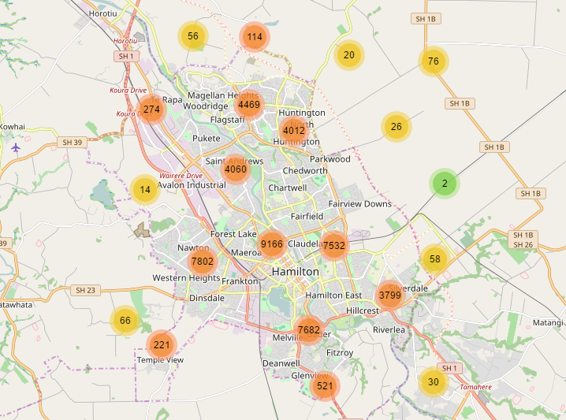

Leaflet.markercluster
=====================

Provides Beautiful Animated Marker Clustering functionality for [Leaflet](http://leafletjs.com), a JS library for interactive maps.

*Requires Leaflet 1.0.0*



For a Leaflet 0.7 compatible version, [use the leaflet-0.7 branch](https://github.com/Leaflet/Leaflet.markercluster/tree/leaflet-0.7)<br>
For a Leaflet 0.5 compatible version, [Download b128e950](https://github.com/Leaflet/Leaflet.markercluster/archive/b128e950d8f5d7da5b60bd0aa9a88f6d3dd17c98.zip)<br>
For a Leaflet 0.4 compatible version, [Download the 0.2 release](https://github.com/Leaflet/Leaflet.markercluster/archive/0.2.zip)

<!---
TOC created with gh-md-toc
https://github.com/ekalinin/github-markdown-toc
removed link to h1 and indented back 2 spaces all links.
-->
## Table of Contents
  * [Using the plugin](#using-the-plugin)
    * [Building, testing and linting scripts](#building-testing-and-linting-scripts)
    * [Examples](#examples)
    * [Usage](#usage)
  * [Options](#options)
    * [Defaults](#defaults)
    * [Customising the Clustered Markers](#customising-the-clustered-markers)
    * [All Options](#all-options)
      * [Enabled by default (boolean options)](#enabled-by-default-boolean-options)
      * [Other options](#other-options)
      * [Chunked addLayers options](#chunked-addlayers-options)
  * [Events](#events)
    * [Additional MarkerClusterGroup Events](#additional-markerclustergroup-events)
  * [Methods](#methods)
    * [Group methods](#group-methods)
      * [Adding and removing Markers](#adding-and-removing-markers)
      * [Bulk adding and removing Markers](#bulk-adding-and-removing-markers)
      * [Getting the visible parent of a marker](#getting-the-visible-parent-of-a-marker)
      * [Refreshing the clusters icon](#refreshing-the-clusters-icon)
      * [Other Group Methods](#other-group-methods)
    * [Clusters methods](#clusters-methods)
      * [Getting the bounds of a cluster](#getting-the-bounds-of-a-cluster)
      * [Zooming to the bounds of a cluster](#zooming-to-the-bounds-of-a-cluster)
      * [Other clusters methods](#other-clusters-methods)
  * [Handling LOTS of markers](#handling-lots-of-markers)
  * [License](#license)
  * [Sub-plugins](#sub-plugins)


## Using the plugin
Include the plugin CSS and JS files on your page after Leaflet files, using your method of choice:
* [Download the `v1.4.1` release](https://github.com/Leaflet/Leaflet.markercluster/archive/v1.4.1.zip)
* Use unpkg CDN: `https://unpkg.com/leaflet.markercluster@1.4.1/dist/`
* Install with npm: `npm install leaflet.markercluster`

In each case, use files in the `dist` folder:
* `MarkerCluster.css`
* `MarkerCluster.Default.css` (not needed if you use your own `iconCreateFunction` instead of the default one)
* `leaflet.markercluster.js` (or `leaflet.markercluster-src.js` for the non-minified version)

### Building, testing and linting scripts
Install jake `npm install -g jake` then run `npm install`
* To check the code for errors and build Leaflet from source, run `jake`.
* To run the tests, run `jake test`.

### Examples
See the included examples for usage.

The [realworld example](https://leaflet.github.io/Leaflet.markercluster/example/marker-clustering-realworld.388.html) is a good place to start, it uses all of the defaults of the clusterer.
Or check out the [custom example](https://leaflet.github.io/Leaflet.markercluster/example/marker-clustering-custom.html) for how to customise the behaviour and appearance of the clusterer

### Usage
Create a new MarkerClusterGroup, add your markers to it, then add it to the map

```javascript
var markers = L.markerClusterGroup();
markers.addLayer(L.marker(getRandomLatLng(map)));
... Add more layers ...
map.addLayer(markers);
```

## Options
### Defaults
By default the Clusterer enables some nice defaults for you:
* **showCoverageOnHover**: When you mouse over a cluster it shows the bounds of its markers.
* **zoomToBoundsOnClick**: When you click a cluster we zoom to its bounds.
* **spiderfyOnMaxZoom**: When you click a cluster at the bottom zoom level we spiderfy it so you can see all of its markers. (*Note: the spiderfy occurs at the current zoom level if all items within the cluster are still clustered at the maximum zoom level or at zoom specified by `disableClusteringAtZoom` option*)
* **removeOutsideVisibleBounds**: Clusters and markers too far from the viewport are removed from the map for performance.
* **spiderLegPolylineOptions**: Allows you to specify [PolylineOptions](http://leafletjs.com/reference.html#polyline-options) to style spider legs. By default, they are `{ weight: 1.5, color: '#222', opacity: 0.5 }`.

You can disable any of these as you want in the options when you create the MarkerClusterGroup:
```javascript
var markers = L.markerClusterGroup({
	spiderfyOnMaxZoom: false,
	showCoverageOnHover: false,
	zoomToBoundsOnClick: false
});
```

### Customising the Clustered Markers
As an option to MarkerClusterGroup you can provide your own function for creating the Icon for the clustered markers.
The default implementation changes color at bounds of 10 and 100, but more advanced uses may require customising this.
You do not need to include the .Default css if you go this way.
You are passed a MarkerCluster object, you'll probably want to use `getChildCount()` or `getAllChildMarkers()` to work out the icon to show.

```javascript
var markers = L.markerClusterGroup({
	iconCreateFunction: function(cluster) {
		return L.divIcon({ html: '<b>' + cluster.getChildCount() + '</b>' });
	}
});
```
Check out the [custom example](https://leaflet.github.io/Leaflet.markercluster/example/marker-clustering-custom.html) for an example of this.

If you need to update the clusters icon (e.g. they are based on markers real-time data), use the method [refreshClusters()](#refreshing-the-clusters-icon).

### All Options
#### Enabled by default (boolean options)
* **showCoverageOnHover**: When you mouse over a cluster it shows the bounds of its markers.
* **zoomToBoundsOnClick**: When you click a cluster we zoom to its bounds.
* **spiderfyOnMaxZoom**: When you click a cluster at the bottom zoom level we spiderfy it so you can see all of its markers. (*Note: the spiderfy occurs at the current zoom level if all items within the cluster are still clustered at the maximum zoom level or at zoom specified by `disableClusteringAtZoom` option*).
* **removeOutsideVisibleBounds**: Clusters and markers too far from the viewport are removed from the map for performance.
* **animate**: Smoothly split / merge cluster children when zooming and spiderfying. If `L.DomUtil.TRANSITION` is false, this option has no effect (no animation is possible).

#### Other options
* **animateAddingMarkers**: If set to true (and `animate` option is also true) then adding individual markers to the MarkerClusterGroup after it has been added to the map will add the marker and animate it into the cluster. Defaults to false as this gives better performance when bulk adding markers. addLayers does not support this, only addLayer with individual Markers.
* **disableClusteringAtZoom**: If set, at this zoom level and below, markers will not be clustered. This defaults to disabled. [See Example](https://leaflet.github.io/Leaflet.markercluster/example/marker-clustering-realworld-maxzoom.388.html). Note: you may be interested in disabling `spiderfyOnMaxZoom` option when using `disableClusteringAtZoom`.
* **maxClusterRadius**: The maximum radius that a cluster will cover from the central marker (in pixels). Default 80. Decreasing will make more, smaller clusters. You can also use a function that accepts the current map zoom and returns the maximum cluster radius in pixels.
* **polygonOptions**: Options to pass when creating the L.Polygon(points, options) to show the bounds of a cluster. Defaults to empty, which lets Leaflet use the [default Path options](http://leafletjs.com/reference.html#path-options).
* **singleMarkerMode**: If set to true, overrides the icon for all added markers to make them appear as a 1 size cluster. Note: the markers are not replaced by cluster objects, only their icon is replaced. Hence they still react to normal events, and option `disableClusteringAtZoom` does not restore their previous icon (see [#391](https://github.com/Leaflet/Leaflet.markercluster/issues/391)).
* **spiderLegPolylineOptions**: Allows you to specify [PolylineOptions](http://leafletjs.com/reference.html#polyline-options) to style spider legs. By default, they are `{ weight: 1.5, color: '#222', opacity: 0.5 }`.
* **spiderfyDistanceMultiplier**: Increase from 1 to increase the distance away from the center that spiderfied markers are placed. Use if you are using big marker icons (Default: 1).
* **iconCreateFunction**: Function used to create the cluster icon. See [the default implementation](https://github.com/Leaflet/Leaflet.markercluster/blob/15ed12654acdc54a4521789c498e4603fe4bf781/src/MarkerClusterGroup.js#L542) or the [custom example](https://leaflet.github.io/Leaflet.markercluster/example/marker-clustering-custom.html).
* **clusterPane**: Map pane where the cluster icons will be added. Defaults to L.Marker's default (currently 'markerPane'). [See the pane example](https://leaflet.github.io/Leaflet.markercluster/example/marker-clustering-pane.html).

#### Chunked addLayers options
Options for the [addLayers](#bulk-adding-and-removing-markers) method. See [#357](https://github.com/Leaflet/Leaflet.markercluster/issues/357) for explanation on how the chunking works.
* **chunkedLoading**: Boolean to split the addLayer**s** processing in to small intervals so that the page does not freeze.
* **chunkInterval**: Time interval (in ms) during which addLayers works before pausing to let the rest of the page process. In particular, this prevents the page from freezing while adding a lot of markers. Defaults to 200ms.
* **chunkDelay**: Time delay (in ms) between consecutive periods of processing for addLayers. Default to 50ms.
* **chunkProgress**: Callback function that is called at the end of each chunkInterval. Typically used to implement a progress indicator, e.g. [code in RealWorld 50k](https://github.com/Leaflet/Leaflet.markercluster/blob/master/example/marker-clustering-realworld.50000.html#L33-L49). Defaults to null. Arguments:
  1. Number of processed markers
  2. Total number of markers being added
  3. Elapsed time (in ms)

## Events
Leaflet events like `click`, `mouseover`, etc. are just related to _Markers_ in the cluster.
To receive events for clusters, listen to `'cluster' + '<eventName>'`, ex: `clusterclick`, `clustermouseover`, `clustermouseout`.

Set your callback up as follows to handle both cases:

```javascript
markers.on('click', function (a) {
	console.log('marker ' + a.layer);
});

markers.on('clusterclick', function (a) {
	// a.layer is actually a cluster
	console.log('cluster ' + a.layer.getAllChildMarkers().length);
});
```

### Additional MarkerClusterGroup Events

- **animationend**: Fires when marker clustering/unclustering animation has completed
- **spiderfied**: Fires when overlapping markers get spiderified (Contains ```cluster``` and ```markers``` attributes)
- **unspiderfied**: Fires when overlapping markers get unspiderified (Contains ```cluster``` and ```markers``` attributes)

## Methods

### Group methods

#### Adding and removing Markers
`addLayer`, `removeLayer` and `clearLayers` are supported and they should work for most uses.

#### Bulk adding and removing Markers
`addLayers` and `removeLayers` are bulk methods for adding and removing markers and should be favoured over the single versions when doing bulk addition/removal of markers. Each takes an array of markers. You can use [dedicated options](#chunked-addlayers-options) to fine-tune the behaviour of `addLayers`.

These methods extract non-group layer children from Layer Group types, even deeply nested. _However_, be noted that:
- `chunkProgress` jumps backward when `addLayers` finds a group (since appending its children to the input array makes the total increase).
- Groups are not actually added into the MarkerClusterGroup, only their non-group child layers. Therfore, `hasLayer` method will return `true` for non-group child layers, but `false` on any (possibly parent) Layer Group types.

If you are removing a lot of markers it will almost definitely be better to call `clearLayers` then call `addLayers` to add the markers you don't want to remove back in. See [#59](https://github.com/Leaflet/Leaflet.markercluster/issues/59#issuecomment-9320628) for details.

#### Getting the visible parent of a marker
If you have a marker in your MarkerClusterGroup and you want to get the visible parent of it (Either itself or a cluster it is contained in that is currently visible on the map).
This will return null if the marker and its parent clusters are not visible currently (they are not near the visible viewpoint)
```javascript
var visibleOne = markerClusterGroup.getVisibleParent(myMarker);
console.log(visibleOne.getLatLng());
```

#### Refreshing the clusters icon
If you have [customized](#customising-the-clustered-markers) the clusters icon to use some data from the contained markers, and later that data changes, use this method to force a refresh of the cluster icons.
You can use the method:
- without arguments to force all cluster icons in the Marker Cluster Group to be re-drawn.
- with an array or a mapping of markers to force only their parent clusters to be re-drawn.
- with an L.LayerGroup. The method will look for all markers in it. Make sure it contains only markers which are also within this Marker Cluster Group.
- with a single marker.
```javascript
markers.refreshClusters();
markers.refreshClusters([myMarker0, myMarker33]);
markers.refreshClusters({id_0: myMarker0, id_any: myMarker33});
markers.refreshClusters(myLayerGroup);
markers.refreshClusters(myMarker);
```

The plugin also adds a method on L.Marker to easily update the underlying icon options and refresh the icon.
If passing a second argument that evaluates to `true`, the method will also trigger a `refreshCluster` on the parent MarkerClusterGroup for that single marker.
```javascript
// Use as many times as required to update markers,
// then call refreshClusters once finished.
for (i in markersSubArray) {
	markersSubArray[i].refreshIconOptions(newOptionsMappingArray[i]);
}
markers.refreshClusters(markersSubArray);

// If updating only one marker, pass true to
// refresh this marker's parent clusters right away.
myMarker.refreshIconOptions(optionsMap, true); 
```

#### Other Group Methods
* **hasLayer**(layer): Returns true if the given layer (marker) is in the MarkerClusterGroup.
* **zoomToShowLayer**(layer, callback): Zooms to show the given marker (spiderfying if required), calls the callback when the marker is visible on the map.

### Clusters methods
The following methods can be used with clusters (not the group). They are typically used for event handling.

#### Getting the bounds of a cluster
When you receive an event from a cluster you can query it for the bounds.
```javascript
markers.on('clusterclick', function (a) {
	var latLngBounds = a.layer.getBounds();
});
```

You can also query for the bounding convex polygon.
See [example/marker-clustering-convexhull.html](https://leaflet.github.io/Leaflet.markercluster/example/marker-clustering-convexhull.html) for a working example.
```javascript
markers.on('clusterclick', function (a) {
	map.addLayer(L.polygon(a.layer.getConvexHull()));
});
```

#### Zooming to the bounds of a cluster
When you receive an event from a cluster you can zoom to its bounds in one easy step.
If all of the markers will appear at a higher zoom level, that zoom level is zoomed to instead.
`zoomToBounds` takes an optional argument to pass [options to the resulting `fitBounds` call](http://leafletjs.com/reference.html#map-fitboundsoptions).

See [marker-clustering-zoomtobounds.html](https://leaflet.github.io/Leaflet.markercluster/example/marker-clustering-zoomtobounds.html) for a working example.
```javascript
markers.on('clusterclick', function (a) {
	a.layer.zoomToBounds({padding: [20, 20]});
});
```

#### Other clusters methods
* **getChildCount**: Returns the total number of markers contained within that cluster.
* **getAllChildMarkers(storage: array | undefined, ignoreDraggedMarker: boolean | undefined)**: Returns an array of all markers contained within this cluster (storage will be used if provided). If ignoreDraggedMarker is true and there is currently a marker dragged, the dragged marker will not be included in the array.
* **spiderfy**: Spiderfies the child markers of this cluster
* **unspiderfy**: Unspiderfies a cluster (opposite of spiderfy)

## Handling LOTS of markers
The Clusterer can handle 10,000 or even 50,000 markers (in chrome). IE9 has some issues with 50,000.
- [realworld 10,000 example](https://leaflet.github.io/Leaflet.markercluster/example/marker-clustering-realworld.10000.html)
- [realworld 50,000 example](https://leaflet.github.io/Leaflet.markercluster/example/marker-clustering-realworld.50000.html)

Note: these two examples use the `chunkedLoading` option set to true in order to avoid locking the browser for a long time.

## License

Leaflet.markercluster is free software, and may be redistributed under the MIT-LICENSE.

[](https://travis-ci.org/Leaflet/Leaflet.markercluster)

## Sub-plugins
Leaflet.markercluster plugin is very popular and as such it generates high and
diverse expectations for increased functionalities.

If you are in that case, be sure to have a look first at the repository
[issues](https://github.com/Leaflet/Leaflet.markercluster/issues) in case what
you are looking for would already be discussed, and some workarounds would be proposed.

Check also the below sub-plugins:

| Plugin | Description | Maintainer |
| :----- | :---------- | :--------- |
| [Leaflet.FeatureGroup.SubGroup](https://github.com/ghybs/Leaflet.FeatureGroup.SubGroup) | Creates a Feature Group that adds its child layers into a parent group when added to a map (e.g. through L.Control.Layers). Typical usage is to dynamically add/remove groups of markers from Marker Cluster. | [ghybs](https://github.com/ghybs) |
| [Leaflet.MarkerCluster.LayerSupport](https://github.com/ghybs/Leaflet.MarkerCluster.LayerSupport) | Brings compatibility with L.Control.Layers and other Leaflet plugins. I.e. everything that uses direct calls to map.addLayer and map.removeLayer. | [ghybs](https://github.com/ghybs) |
| [Leaflet.MarkerCluster.Freezable](https://github.com/ghybs/Leaflet.MarkerCluster.Freezable) | Adds the ability to freeze clusters at a specified zoom. E.g. freezing at maxZoom + 1 makes as if clustering was programmatically disabled. | [ghybs](https://github.com/ghybs) |
| [Leaflet.MarkerCluster.PlacementStrategies](https://github.com/adammertel/Leaflet.MarkerCluster.PlacementStrategies) | Implements new strategies to position clustered markers (eg: clock, concentric circles, ...). Recommended to use with circleMarkers. [Demo](https://adammertel.github.io/Leaflet.MarkerCluster.PlacementStrategies/demo/demo1.html) | [adammertel](https://github.com/adammertel) / [UNIVIE](http://carto.univie.ac.at/) |
| [Leaflet.MarkerCluster.List](https://github.com/adammertel/Leaflet.MarkerCluster.List) | Displays child elements in a list. Suitable for mobile devices. [Demo](https://adammertel.github.io/Leaflet.MarkerCluster.List/demo/demo1.html) | [adammertel](https://github.com/adammertel) / [UNIVIE](http://carto.univie.ac.at/) |
