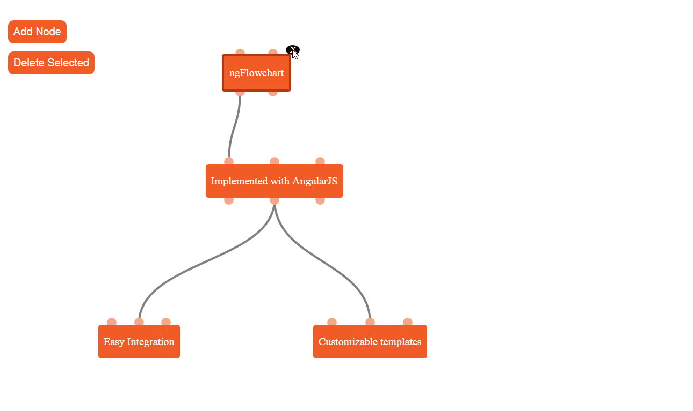

# ngFlowchart [](https://github.com/ONE-LOGIC/ngFlowchart) [](https://travis-ci.org/ONE-LOGIC/ngFlowchart/) [](https://gemnasium.com/ONE-LOGIC/ngFlowchart)

ngFlowchart is an easy and customizable way to draw flowchart graphs using AngularJS. Its main features are:
* Native AngularJS support
* An easy way to customize the look of nodes, by writing your own [template](#the-node-template) 
* Automatically adjusts size to its graph

<a href="http://one-logic.github.io/ngFlowchart/dist/index.html" target="_blank">
  
</a>
<a href="http://one-logic.github.io/ngFlowchart/dist/index.html" target="_blank">Visit the live demo</a>

## Getting Started

Install ngFlowchart via bower with `bower install ngFlowchart`

Run `gulp` in the ngFlowchart directory to start an interactive demo.

## Table of Contents
* [Getting Started](#getting-started)
* [Integration](#integration)
* [API](#api)
  * [Model](#the-model) 
  * [fc-canvas attribute](#fc-canvas-attributes)
  * [Setting your own node template](#the-node-template)
* [Browser Support](#browser-support)

## Integration

Add stylesheet:
```html
<link rel="stylesheet" href="bower_components/ngFlowchart/dist/flowchart.css" type="text/css">
```

Include script:
```html
<script src="bower_components/ngFlowchart/dist/ngFlowchart.js"></script>
```

Use the `fc-canvas` directive to display the graph:
```html
<fc-canvas model="model" selected-objects="flowchartselected" edge-style="line"></fc-canvas>
```

Add `model` and `selectedObjects` to your scope:
```javascript
model = {
  nodes: [
    { 
      id: 1, 
      x: 10, 
      y: 10, 
      name: "My first node", 
      connectors: [
        {
          id: 1, 
          type: bottomConnector
        }
      ]
    },
    { 
      id: 2, 
      x: 50, 
      y: 50, 
      name: "My seconde node", 
      connectors: [
        {
          id: 2, 
          type: topConnector
        }
      ]
    }
  ],
  edges: [
    {
      source: 1, 
      destination: 2,
      active: false
    }
  ]
};
    
flowchartselected = [];
```

Your site should now show your first flowchart with two connected nodes.

## Api

### The model

```javascript
{
  nodes: [Node],
  edges: [Edge]
}
```

#### Node
```javascript
{
  id: integer,
  name: string,
  x: integer, // x-coordinate of the node relative to the canvas.
  y: integer, // y-coordinate of the node relative to the canvas.
  connectors: [Connector]
}
```

#### Connector
```javascript
{
  id: integer,
  type: string
}
```

#### Edge
```javascript
{
 source: Connector.id
 destination: Connector.id
 active: boolean
}
```

### fc-canvas attributes
* `model` The model.
* `selected-objects` The selected nodes and edges as objects. Example: `[{id: 1, name: "First node", {...}}, {source: 1, destination: 2}]`
* `edge-style` "line" or "curved".
* `automatic-resize` If `true` the canvas will adjust its size while node dragging and allow "endless" dragging.
* `drag-animation` Either `repaint` (default) or `shadow` where `repaint` repaints the whole flowchart including edges according to new position while `shadow` show the new position only by showing a shadow of the node at the new position and repaints the edges only at the end of dragging.
* `callbacks` Object with callbacks.
  * `edgeAdded` will be called if an edge is added by ngFlowchart. 
  * `edgeDoubleClick(event, edge)` will be called when an edge is doubleclicked.
  * `edgeMouseOver(event, edge)` will be called if the mouse hovers an edge.
  * `isValidEdge(sourceConnector, destinationConnector)` will be called, when the user tries to connect to edges. Returns `true` if this is an valid edge in your application or `false` otherwise.
  * `edgeRemoved(edge)` will be called if an edge has been removed
  * `nodeRemoved(node)` will be called if a node has been removed
  * `nodeCallbacks` an object which will be available in the scope of the node template. This is usefull, to register a doubleclick handler on a node or similiar things. Every method that is handed into the `nodeCallbacks` will be available in the node template via the `callbacks` attribute.
 
### The Node template
Easily change the look and feel of the graph by writing your own node template. This is a simple AngularJS template registered with our `NodeTemplatePath` provider:

```javascript
angular.module('yourApp', ['flowchart'])
  .config(function(NodeTemplatePathProvider) {
    NodeTemplatePathProvider.setTemplatePath("path/to/your/template/node.html");
  })
```

The $scope in this template includes following variables:
* `node` The node object from the model.
* `modelservice` The modelservice instance of this canvas.
* `underMouse` `true` when the mouse hovers this node, `false` otherwise.
* `selected` `true` if this node is selected, `false` otherwise.
* `mouseOverConnector` The connector object from the model witch is hovered by the mouse or `null`.
* `draggedNode` The node object from the model witch is dragged.
* `nodeCallbacks` The object you assigned to `nodeCallbacks` on the `callbacks` attribute of `fc-canvas`.

### Modelservice
Our `Modelfactory` could contain some interesting functions for you to use.
Instantiate it with `Modelfactory(model, selectedObjects)` with model and selectedObjects as references to the same objects you gave the canvas.


## Browser Support
ngFlowchart supports Chrome, Firefox, Opera and IE10+. Safari is not supported. PRs to expand support are welcome.

Right now it is only possible to have one canvas per site, this may changes in future.

###Sponsors
Thanks to BrowserStack for kindly helping us improve cross browser support.